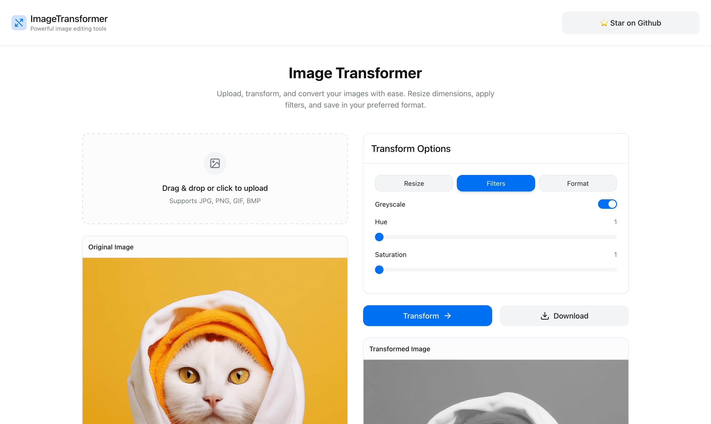

# 🖼️ Image Transformer ✨

A lightweight, browser-based image transformation tool that allows you to resize images, apply filters, and convert between various image formats quickly and efficiently.



## 🔗 [Live Demo](https://imagetransformer.megaconfidence.me/)

Try the application live at [https://imagetransformer.megaconfidence.me/](https://imagetransformer.megaconfidence.me/) 🚀

## ✨ Features

- **Image Upload**: Drag & drop or select images from your device
- **Resize Options**: Adjust width and height (1-2000px)
- **Filter Effects**:
  - Greyscale toggle
  - Hue adjustment (1-100)
  - Saturation control (1-100)
- **Format Conversion**: Convert between PNG, JPEG, GIF, and BMP formats
- **Real-time Preview**: View both original and transformed images side by side
- **Easy Download**: Download your transformed images with a single click

## 🛠️ Technology Stack

- **Frontend**: Vanilla JavaScript, HTML, and CSS
- **UI Design**: Custom Material Design-inspired interface
- **Backend**: Cloudflare Workers with transformation workflows

## 🚀 Getting Started

### Local Development

1. Clone the repository:

   ```bash
   git clone https://github.com/megaconfidence/image-transformer.git
   cd image-transformer
   ```

2. Install dependencies:

   ```bash
   npm install
   ```

3. Run dev server and visit [http://localhost:8787](http://localhost:8787) in your brwoser:
   ```
   npm run dev
   ```

## 💡 How It Works

1. **Upload an Image**: Either drag and drop an image onto the upload area or click to select a file.
2. **Configure Transformations**: Adjust the resize dimensions, apply filters, and select an output format.
3. **Transform**: Click the "Transform" button to send the image to the server for processing.
4. **Preview & Download**: View the transformed image and download it in your chosen format.

## 🔧 Backend Architecture

The Image Transformer backend is built on **Cloudflare Workers** ☁️ and utilizes a workflow-based approach for image processing:

1. When an image is uploaded with transformation parameters, the backend initiates a transformation workflow
2. The workflow processes the image according to the specified parameters
3. Once complete, the transformed image is made available for viewing and downloading

### API Endpoints

The application interacts with three primary API endpoints:

#### 1. Upload Endpoint 📤

Initiates the transformation workflow and returns a workflow ID:

```
POST http://localhost:8787/upload
```

**Parameters:**

- `resize[w]`: Width in pixels (1-2000)
- `resize[h]`: Height in pixels (1-2000)
- `format`: Output format (png, jpeg, gif, bmp, tiff)
- `filter[greyscale]`: Apply greyscale (empty value enables)
- `filter[hue]`: Hue adjustment (0-100)
- `filter[saturate]`: Saturation adjustment (0-100)

**Example:**

```
http://localhost:8787/upload?resize[w]=500&resize[h]=800&format=png&filter[greyscale]&filter[hue]=60&filter[saturate]=10
```

#### 2. Status Endpoint 🔍

Checks the status of a transformation workflow:

```
GET http://localhost:8787/status/:id
```

**Parameters:**

- `id`: The workflow ID returned by the upload endpoint

**Example:**

```
http://localhost:8787/status/0b237822-a6ca-4cb0-a04a-292d642aba65
```

**Response:**

```json
{
	"status": "completed",
	"errors": ""
}
```

#### 3. View Endpoint 👁️

Returns the transformed image:

```
GET http://localhost:8787/view/:id
```

**Parameters:**

- `id`: The workflow ID returned by the upload endpoint

**Example:**

```
http://localhost:8787/view/0b237822-a6ca-4cb0-a04a-292d642aba65
```

**Response:**
The transformed image file in the requested format.

## 📝 License

This project is licensed under the MIT License - see the LICENSE file for details.

## 🤝 Contributing

Contributions, issues, and feature requests are welcome! ✨ Feel free to check the issues page.

1. Fork the repository
2. Create your feature branch (`git checkout -b feature/amazing-feature`)
3. Commit your changes (`git commit -m 'Add some amazing feature'`)
4. Push to the branch (`git push origin feature/amazing-feature`)
5. Open a Pull Request

## 📬 Contact

[@megaconfidence](https://x.com/megaconfidence)

Project Link: [https://github.com/megaconfidence/image-transformer](https://github.com/megaconfidence/image-transformer)
